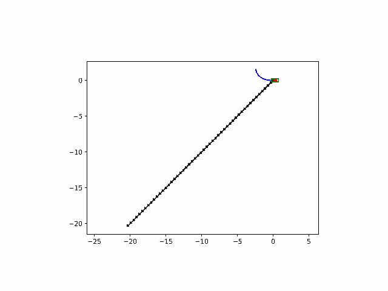
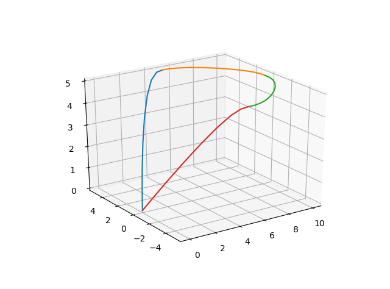

## Docker

Build and start the docker container:
`$ ./docker_build.bash`

Point docker container to use your monitor:
`$ xhost +local:docker`

Start and enter the docker container:
`$ docker exec -it control_scripts-ros-1 bash`

## iLQR

## Quadratic Program Trajectory

